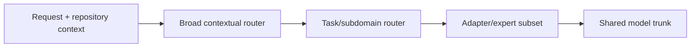
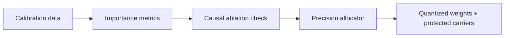
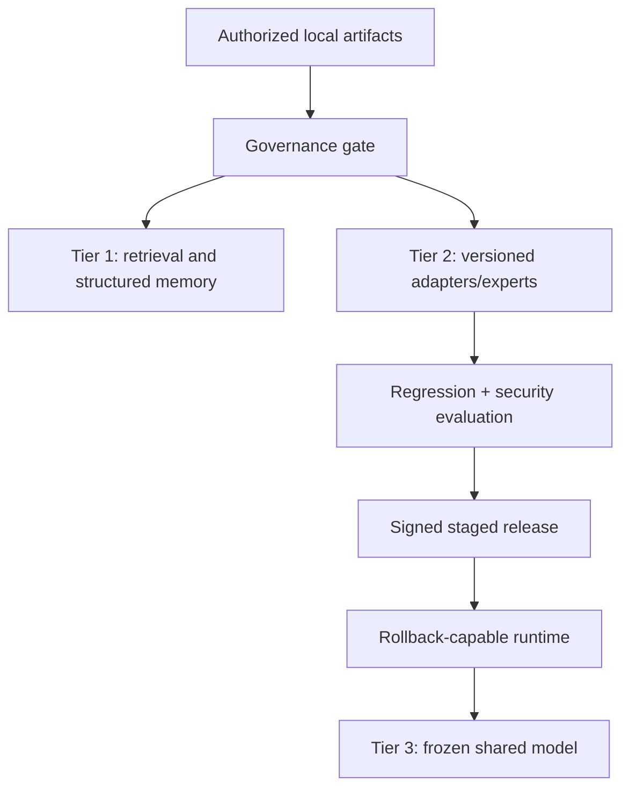

# Candidate Architectures

## A1: Contextual Hierarchical Router

Tensor shape: hidden states `[batch, tokens, d_model]`; router logits `[batch, tokens, levels, branches]`; selected experts `[top_k, d_model, d_ff]`.

Failure modes: router collapse, multi-domain prompts, rare routes, dispatch overhead, GPU underutilization, and semantic labels that do not map to causal specialization.

Smallest falsifier: E1.

## A2: Shared Bases Plus Route-Specific Coefficients

Logical tensor: `Theta[layer, route, component, version] = Base[layer, component] @ Coeff[route, version] + SparseResidual`.

Storage format: base matrices, route coefficients, sparse residual indexes/values, version metadata, and reconstruction cache.

Failure modes: coefficient metadata exceeds savings, reconstruction latency dominates, and route-specific deltas do not preserve quality.

Smallest falsifier: E2.

## A3: Causal-Importance Precision Policy

Candidate carriers: tensors, channels, attention heads, MLP features, experts, shared experts, sparse residuals, and codebook entries.

Failure modes: activation salience is not causal, random protection performs equally, FP32 carriers cost more than they help, and hardware kernels do not support the layout.

Smallest falsifier: E3.

## A4: Indexed Component Bank

Query construction: `q = f(hidden_state, task, repo_scope)`.

Lookup options: dense router, exact vector search, centroid tree, approximate nearest neighbor, hash routing, cache key, and predictive prefetch.

Failure modes: index memory, stale indexes, low recall, authorization filter overhead, and end-to-end latency worse than dense routing.

Smallest falsifier: E4.

## A5: Three-Timescale Continual Evolution

Failure modes: future leakage, poisoning, unauthorized retrieval, adapter forgetting, unbounded storage growth, and model-generated text treated as ground truth.

Smallest falsifier: E5.

## Integrated Candidate

Only justified if A1-A5 produce component evidence. A possible design combines deterministic authorization, structured retrieval, hierarchical adapter routing, shared compressed bases, protected carrier residuals, indexed component selection for large banks, signed artifacts, and rollback. It must be compared against frozen model plus local RAG and adapters before any deployment claim.

