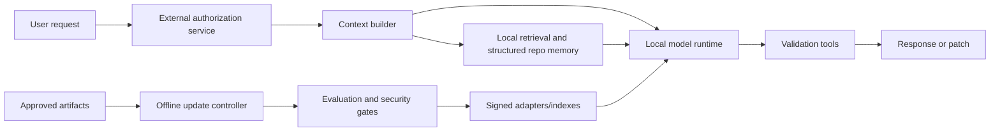

# On-Premises Architecture

Production must operate without cloud inference, cloud embeddings, external telemetry, external vector databases, external training services, unapproved network access, or uploading prompts/code/indexes/logs/model updates.

Network access in this research repository is limited to explicit literature/source retrieval and package installation during public research.

